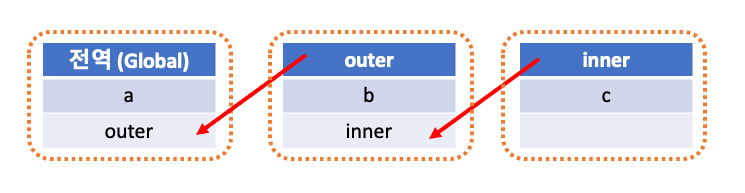

# 스코프 (22.08.13)
---

## 스코프란?
스코프는 변수 이름, 함수 이름, 클래스 이름과 같은 식별자가 본인이 선언된 위치에 따라 다른 코드에서 <b>자신이 참조될 수 있을지 없을지 결정되는 규칙</b>을 말한다.
#### 
```javascript
var a = 1;
function outer() {
    var a = 50;

    function inner() {
        var a = 999;
        console.log(a); // a라는 변수가 3개인데, 누굴 콘솔에 남겨야하지?
    }

    inner();
}
console.log(a); // 누굴 콘솔에 남겨야하지?

outer();
```
위와 같은 상황 등에서 <b>어떤 변수를 참조할지 결정하는 규칙</b>이다.
###

스코프는 두가지로 나뉠 수 있다.
- 전역 스코프 (Global Scope): 코드 어디서든 참조가 가능
  - 전역 스코프 안에 있는 변수를 전역 변수 (Global Variable, Global Value) 라 한다.
- 지역 스코프 (Local Scope or Function-Level Scope): 함수 코드 블록이 만든 스코프로, 함수 자신과 하위 함수에서만 참조가 가능하다.
  - 지역 스코프 안에 있는 변수를 지역 변수 (Local Variable, Global Value) 라고 한다.

```javascript
var a = 1; // 전역 변수 (전역 스코프)
function someFunc() {
    var b = 50; // 지역 변수 (지역 스코프, 함수 레벨 스코프)
}
console.log(a); // 1
console.log(b); // ReferenceError: b is not defined
...
```
위와 같은 코드에서 a는 참조가 가능하지만 b의 경우 참조에러가 발생한다.
지역 스코프 내에 있는 변수는 스코프를 만들어낸 함수 자신과 하위 함수에서만 참조가 가능하기 때문이다.

## 스코프 체인
####
```javascript
var a = 1;
function outer() {
    var b = 2;
    console.log(a);
    
    function inner() {
        var c = 3;
        console.log(b);
    }
    return inner;
}
outer();
```
####
위와 같은 코드가 있을 때, 각 스코프와 변수들의 관계를 그려보면 아래 이미지와 같다.

inner 함수는 스코프를 가지며, 그 스코프 내에는 c라는 변수가 있다.
outer 함수는 스코프를 가지며, 그 스코프 내에는 b라는 변수와 inner라는 함수를 담고 있다.
특정함수 내부에 선언되지 않은 변수 a와 outer는 전역 스코프에 포함되어있다.

inner 함수 내부를 보면 outer의 b 변수를 콘솔로 남기고 있는데, inner의 스코프 내에는 b 변수가 없다.
이런 경우 상위 스코프로 이동하여 변수를 탐색한다. 상위 스코프로 올라간 결과 b를 찾았다. 해당 변수를 콘솔에 남기게 된다.

이처럼 여러 스코프의 연결(참조)를 스코프 체인(Scope-chain)이라고 한다.

## 스코프가 결정되는 순간
자바스크립트는 '렉시컬 스코프(Lexical Scope)'를 따른다.
렉시컬 스코프란 <b>변수 및 함수/블록 스코프를 어디에 작성하였는가에 따라 정해지는 스코프</b>를 말한다.
즉, 어디에서 호출되었는지가 아니라 어디에 선언되었는지에 따라 스코프가 정해진다는 것이다.

```javascript
function funcA() {
    ...
}

function funcB() {
    ...
}

function mFunction() {
    funcA();
    funcB();
}
```
위와 같은 코드가 있을때 호출은 mFunction이란 함수에서 이루어졌으나 funcA와 funcB의 스코프는 전역 스코프에 속해있다.

---
- [10분 테코톡 - 엘라의 Scope & Closure](https://www.youtube.com/watch?v=PVYjfrgZhtU&ab_channel=%EC%9A%B0%EC%95%84%ED%95%9CTech)
- [https://poiemaweb.com/js-scope](https://poiemaweb.com/js-scope)