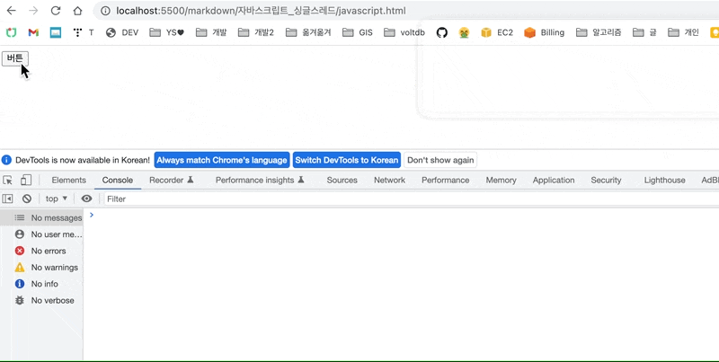
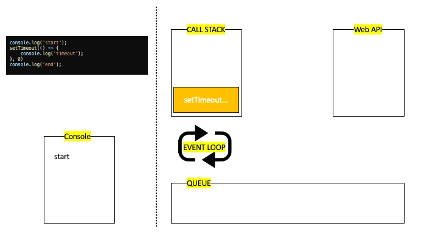
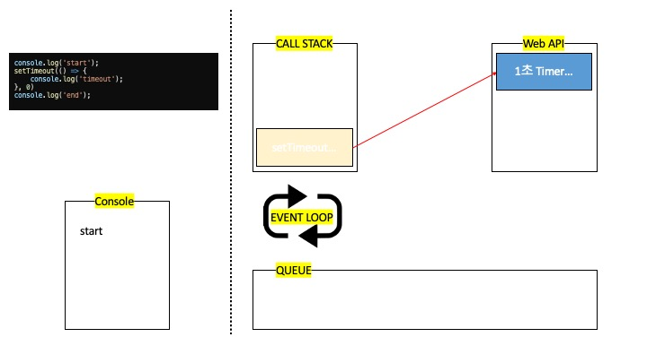
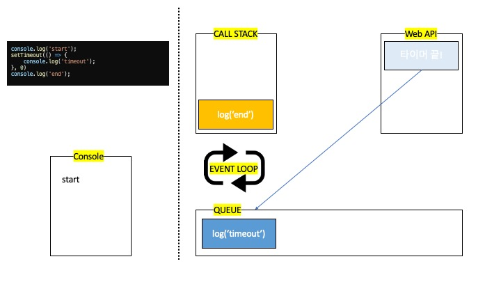
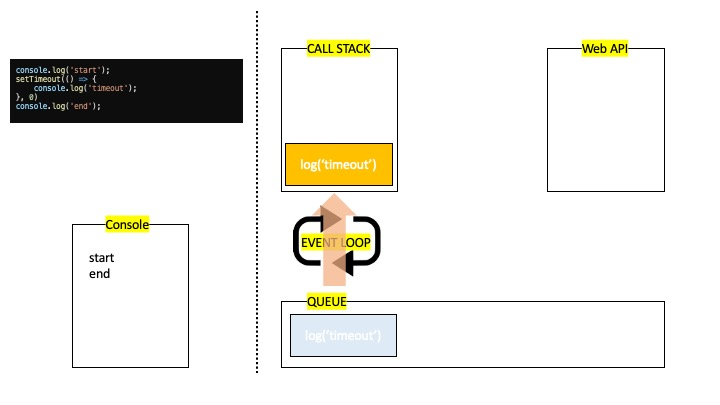
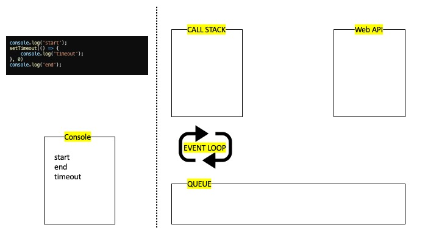

# 자바스크립트는 싱글스레드 (22.08.16)

---
## 자바스크립트는 싱글 스레드이다.

싱글 스레드라는 것은 <b>동기적(순차적)으로 한 번에 하나의 일만 처리할 수 있다는 것</b>이다.

```javascript
function print2() {
    console.log('2');
}

function doSomething() {
    console.log('doSomething');
}

function main() {
    console.log('1');
    print2();
    doSomething();
}

main();
```
위와 같은 코드가 있다면 콘솔에 찍히는 순서는 1 -> 2 -> doSomething이다.
main 함수가 실행되고 내용이 한 줄 한 줄 내려오면서 실행되기 때문이다.

자바스크립트의 싱글 스레드이므로 발생되는 현상에 대해 알아보자.
하나의 버튼을 만들어 아래와 같은 이벤트 리스너를 달았다.
```javascript
document.getElementById('btn').addEventListener('click', () => {
    alert('hi');
    console.log('bye')
})
```
아마 버튼을 클릭하면 alert창을 띄우고, bye를 콘솔에 찍어야할 것이다.

alert는 동기함수(뒤에서 설명하겠다.)이므로 alert의 처리가 끝나기 전까진 다음 코드로 진행되지 않는다.
우리가 '확인'을 클릭하기 전까진 alert 함수의 처리가 끝나지 않았으므로 콘솔에 bye는 출력되지않다가 '확인'을 클릭하는 순간 코드가 전개된다.
처리할 일이 끝나지 않아 코드 진행이 막히는 이러한 현상을 <b>블로킹(blocking)</b>이라고 한다.
자바스크립트는 위 예시로 알 수 있듯 싱글 스레드로써 코드를 처리한다.

그렇다면 아래와 같은 코드는 어떻게 동작해야할까?
```javascript
function print2() {
    setTimeout(() => {
        console.log('timeout');
        console.log('2');
    }, 1000)
}

function doSomething() {
    console.log('doSomething');
}

function main() {
    console.log('1');
    print2();
    doSomething();
}

main();
```
<b>순차적으로 한 번에 하나의 일만 처리할 수 있다는 것</b>을 생각해보면 main 함수 호출 이후,
1 -> (1초 기다림) -> timeout -> 2 -> doSomething이 찍혀야할 것이다.

```
1
doSomething
timeout
2
```
그러나 실제 콘솔에 찍히는 것은 1 -> doSomething -> timeout -> 2 의 순서로 찍힌다.
블로킹 현상까지 알아보았는데 어떻게 된 일인걸까? 자바스크립트는 싱글 스레드가 아닌걸까?
그러나 자바스크립트는 <b>싱글 스레드가 맞다.</b> 그렇다면 어떻게 이런 일이 가능한 것일까?

## 콜 스택, 큐와 이벤트 루프 (call stack, callback queue, Event Loop)

잠시 다른 개념을 알아보도록 하자.

```javascript
console.log('start');
setTimeout(() => {
    console.log('timeout');
}, 0)
console.log('end');
```
이와 같은 코드가 있다면 콘솔엔 어떻게 찍히게 될까?
start -> timeout -> end 순으로 찍혀야할 것 같지않을까?
그러나 start -> end -> timeout 순으로 콘솔에 남는 것을 알 수 있다.
어째서 이러한 현상이 발생하게 되는 걸까?

자바스크립트에는 콜 스택(call stack)과 큐(queue), 이벤트 루프(event loop)라는 것이 존재한다.

우리의 코드는 한 줄 한 줄 순차적으로 콜 스택에 들어가고, 콜 스택은 가장 위에 있는 작업을 꺼내 수행하고 제거한다. (스택의 성질인 후입선출)
위와 같은 코드가 있다면 가장 첫번째로 스택에 들어가는 코드는 'console.log('start')'이다.

'console.log('start')' 가 스택에 들어가고, 함수가 실행된다.

함수가 실행되면 콘솔에는 'start'라는 글자가 남게되고 스택에 남아있던 작업은 사라지게 된다.
이제 다음 줄의 코드를 스택에 넣는다.
다음 줄의 코드는 <b>0초 간 대기</b>한 이후 콘솔에 'timeout'이라는 문자열을 남기는 것이다.
그러나 setTimeout은 스택에서 기다리는 것이 아니라, <b>브라우저의 Web API에 전가</b>된다.

자바스크립트 엔진은 Web API에게 setTimeout의 콜백내용(위 코드의 경우 console.log('timeout')를 전달하고 타이머를 가동시킨다.

결과적으로 setTimeout의 처리(Web API에게 전가)를 마쳤으므로 스택에서 setTimeout은 사라지고 다음 줄의 코드를 수행할 수 있게 된다.

스택에 다음 줄 코드가 들어가고 그 사이에 Web API 안에서 타이머가 종료되었다.
그러나 Web API 안에서 종료된 함수는 바로 스택으로 이동하지않고 태스크 큐(task queue)로 이동하게 된다.

그 사이 스택에 들어가있던 함수의 처리가 끝나 콘솔에 'end'를 남기게된다.

이때 이벤트 루프가 등장하는데, <b>이벤트 루프는 스택이 비어있는지, 큐가 차있는지를 계속 감시하다가 스택이 비어 큐 안에 있는 작업이 들어갈 수 있을 때 큐의 있는 작업을 스택에 넣는다. </b>
0초라는 무의미한 시간을 대기하고 실행되는 setTimeout 함수가 맨 마지막에 실행되는 것은 스택이 빌때까지 자신이 끼어들어갈 자리가 없기 때문이다.

이벤트 루프에 의해 비어진 스택에 큐에 들어가있던 작업이 추가되게 되고

스택에 남은 작업이 실행되고나면 콘솔에 마지막으로 'timeout'이 남으며 종료된다.

이렇듯 자바스크립트 엔진은 스택에서 작업을 처리하지만 비동기적인 처리를 해야하는 작업들은 Web API와 큐, 이벤트 루프의 도움을 받아 처리하게 된다.

우리가 싱글 스레드인 자바스크립트에서 AJAX 요청이나 DOM 이벤트 등의 처리를 비동기 방식으로 처리할 수 있는 것이 바로 이 때문이다.

#### 요약
자바스크립트는 싱글 스레드이므로 순차적으로 한 개의 작업만 수행 할 수 있다.
이와 동시에 Web API와 큐, 이벤트 루프의 도움을 받아 비동기적이고 막힘없는 (Non-Blocking) 코드진행을 구현할 수 있다.
(ex. DOM API, HTTP Request, Timer(setTimeout, setInterval) 등)